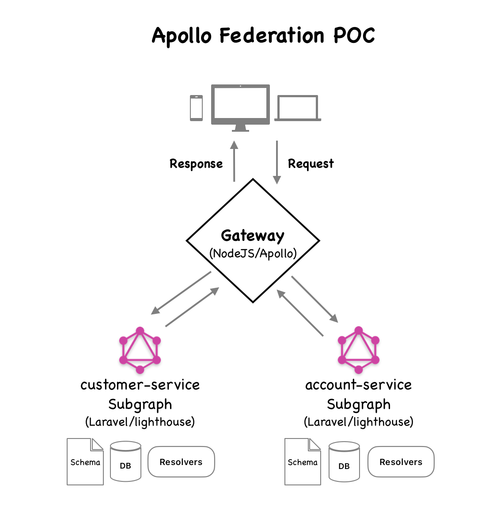

# federatedPOC

This is a POC to demostrate creating GraphQL subgraphs (microservices) using php Laravel and *[lighthouse php framework](https://lighthouse-php.com/)* and that we can combine mutliple microservices into a supergraph or Gateway.  Consumers can query the supergraph and fetch data from all of the subgraphs with a single request.

This POC includes customers-service and accounts-service, two subgraphs, and a gateway that combines the data for accounts and customers.


### Architecture Overview 

<!--  -->



### Local dev requirements for this project.
1. php 8.x and composer
2. node 18.x or higher
3. *[apollo studio account](https://studio.apollographql.com/signup?from=%2F)*   
   This is needed to run the supergraph in the sandbox.

##  What's included
This project includes 3 directories
1. **accounts-service**   
This is a microservice example of customers GraphQL built with laravel and *[php lighthouse](https://lighthouse-php.com/)* integration.

2. **customer-service**   
This is a microservice example of accounts GraphQL built with laravel and *[php lighthouse](https://lighthouse-php.com/)* integration.

3. **gateway-supergraph**  
this is the supergraph built with nodeJS and apollo-server and apollo-gateway.  This is configured for local development only.


### Instructions

#### 1. Clone this project and cd to the projects directory  
```bash
git clone git@gitlab.guildmortgage.com:developers-aws/federatedpoc.git
cd federatedpoc
``` 

#### 2. Install and run the customer-service microservice  
```bash
cd customer-service  
composer install 
touch database/database.sqlite 
cp .env.example .env 
php artisan migrate 
php artisan serve 
``` 

#### 3. Open a new terminal and install and run the accounts-service microservice 
```bash
cd accounts-service 
composer install 
touch database/database.sqlite 
cp .env.example .env 
php artisan migrate 
php artisan serve 
```

#### 3. Open a new terminal and install and run the supergraph   
```bash
cd  gateway-supergraph
npm install
npm start
```

### Test the supergraph via the Apollo Studio Sandbox 
browse to http://localhost:4000/ in your browser.  This will redirect you to the sandbox on grahpql studio.  You will also need a *[apollo studio account](https://studio.apollographql.com/signup?from=%2F)* to run this.

In the sandbox explorer, click on the explorer icon on the left to test the queries and mutations.  See below for examples.

### Example Queries and Mutations 

You can copy and paste the querries/mutations below in the sandbox explorer to test them locally.

```bash
  mutation CreateAccount($input: CustomerInput!) {
  createCustomer(input: {
    email: "test54@example.org",
    first_name: "Test4",
    last_name: "Tester4",
    password: "Password123"
  }) {
    cust_id
    email
    first_name
    is_enabled
    last_name
    user {
      email
      username
    }
  }
}
```

For the mutation below, use the cust_id from the above result for createCustomer, or a valid cust_id.

```bash
mutation CreateAccountt {
  createAccount(input: { acct_number: "267676", cust_id: "6"}) {
    acct_id
    acct_number
    cust_id
    customer {
      email
    }
  }
}
```

At this point a customer record has been created on the customer-service and account record created on the accounts-service api's.

Now we can query a combination of the two objects through federation. The data related to the account object is handled by the accoutns-service api, and related customer data is handled by the customer-service api.  The result is combined through the federation.  See code for comments on how this is accomplished.


```bash
query Accounts {
  accounts {
    acct_id
    cust_id
    customer {
      cust_id
      email
      first_name
      is_enabled
      last_name
      user {
        email
        enabled
        id
        username
      }
    }
    acct_number
  }
}
```


